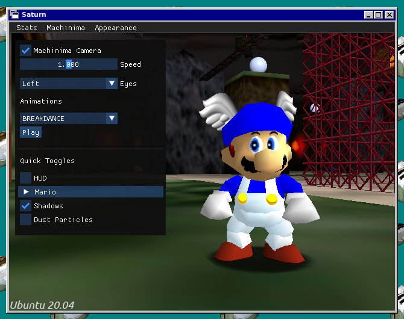

# Saturn

- Saturn is a fork of [sm64pc/sm64ex](https://github.com/sm64pc/sm64ex) with machinima features.
- In order to compile the editor, a prior copy of the game is required. This is to avoid including any copyrighted material.

#### Features

- New camera system
  - Doesn't rely on M64MM's pause camera method, allowing more freedom
  - You can rotate the frozen camera by entering Mario camera
  - Works in all levels
- Live model loading
  - Not only allows color codes, but also custom textures AND/OR models
  - Can be used in the pause menu (don't need to restart the game)
  - Supports Fast64
  - *A color code tutorial/conversion tool is in progress*
- Changeable eye states
  - When paired with texture packs, you can create custom eye textures
- Completely rebindable controls
  - All controls in the game, including those used for machinima, are 100% configurable
  - Controller support
  - HUD, head rotations, fullscreen, etc. can also be toggled in the pause menu

## Building

For building instructions, please refer to the [wiki](https://github.com/Llennpie/Saturn/wiki).

*Note that building for Windows requires [MSYS2](https://www.msys2.org/).*