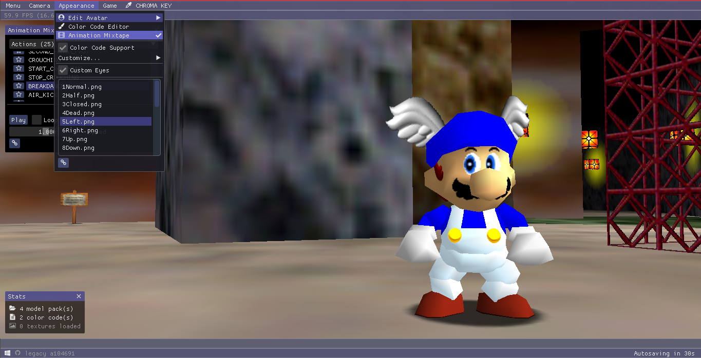

# Saturn

- Saturn is a fork of [sm64pc/sm64ex](https://github.com/sm64pc/sm64ex) with machinima features.
- In order to compile the editor, a prior copy of the game is required. This is to avoid including any copyrighted material.

#### Features

- New machinima camera system
- Color code system
  - Uses the common *GameShark* format
- Live model loading (via DynOS)
  - Uses Fast64 models
  - Works with color codes
- Changeable eye states/textures
- Completely rebindable controls
  - All controls in the game, including those used for machinima, are 100% configurable

## Installation

For building instructions, please refer to the [wiki](https://github.com/Llennpie/Saturn/wiki). 
Saturn currently supports Windows ([MSYS2](https://www.msys2.org/)) and Linux.

*See [here](https://github.com/sm64pc/sm64ex/wiki) for other untested build platforms. These may require source code modifications.*

*In case you feel this project deserves some extra love, I have a Ko-fi below.*

